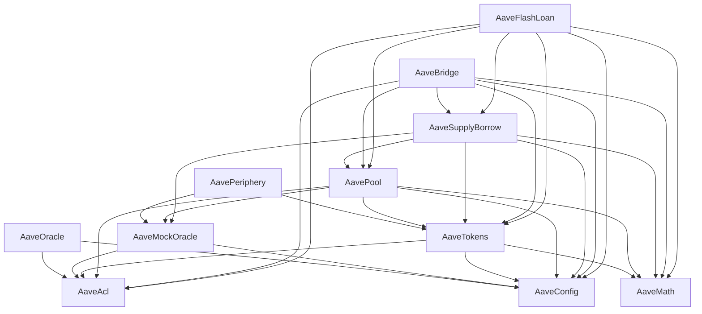

# Aave's V3 Protocol on Aptos

This is the official Aptos version of the Aave V3 Protocol.

## Aptos Packages Overview

```bash=
├── aave-acl           // Access control list Package
├── aave-bridge        // Bridge Package
├── aave-config        // Configurator Package
├── aave-flash-loan    // Flash loan Package
├── aave-math          // Math library Package
├── aave-oracle        // Pyth Oracle Package
├── aave-mock-oracle   // Mock Oracle Package
├── aave-pool          // Pool Package
├── aave-supply-borrow // Supply-Borrow Package
├── aave-tokens        // Tokens Package
├── aave-periphery     // Periphery Package
```

Dependencies for all packages:

<!--
    subgraph Level 1
      AaveAcl
      AaveConfig
      AaveMath
    end

    subgraph Level 2
      AaveOracle
      AaveMockOracle
      AaveTokens
    end

    subgraph Level 3
      AavePeriphery
      AavePool
    end

    subgraph Level 4
      AaveSupplyBorrow
    end

    subgraph Level 5
      AaveBridge
      AaveFlashLoan
      AaveScripts
    end
-->



## 1. Clone the code

```bash=
git clone this-project-code && cd this-project-code
```

Make sure you have the following installed and configured:

- Aptos-Cli [see here](https://aptos.dev/tools/aptos-cli/)
- NodeJS/pnpm/npm/yarn [see here](https://pnpm.io/installation)

## 2. Local Testnet (recommended for development)

Local testnet commands are all bundled inside a `Makefile` at the root.

There is a `.env.local` template at the root that we recommend renaming to `.env` before executing the remaining steps.

Prior to all, run:

```shell
make set-workspace-config
```

to set up your aptos profiles configuration to point at the project workspace.

Then, to run a local testnet, execute:

```shell
make local-testnet
```

Once local testnet is running, in another terminal do:

```shell
make init-profiles && make init-test-profiles && make fund-profiles && make fund-test-profiles
```
This will create all needed accounts for publishing Aaave V3 and save them under a file under `.aptos/config.yaml` at the workspace root.
The accounts will be prefunded with APT too. The structure of the file is something like:

```shell
   profiles:
     profileX:
        private_key: "..."
        public_key: "..."
        account: ...
        rest_url: "https://fullnode.....aptoslabs.com"
        faucet_url: "https://faucet.....aptoslabs.com"
     profileY:
        ...
```
All aave packages can be now compiled using the command:

```shell
make compile-all
```
and subsequently deployed to local testnet via:

```shell
make publish-all
```
If needed one could also run all aptos unit tests via:

```shell
make test-all
```

To view transactions or query any data deployed on the local testnet you
can use the following url:

https://explorer.aptoslabs.com/?network=local


## 3. Testnet, Devnet

All necessary commands required for mainnet, testnet and devnet are bundled in the `Makefile` at the root.

Before anything, for testnet or devnet, the `.env.testnet` file located at the root of this repo is to be renamed to `.env` and adjusted before compiling
and publishing depending on what network we want to deploy our packages to. The default configuration is pointing
at Aptos `testnet`, but one could also easily change the environmental variable `APTOS_NETWORK` to `devnet`.

For testnet and devnet deployment a funded with APT account (5 APT is more than enough) is required so make sure you have one and replace
its private key in `DEFAULT_FUNDER_PRIVATE_KEY`.

The remaining steps are as similar to the local testnet, but using the `Makefile`.

```shell
make compile-all
```
and subsequently deployed to local testnet via:

```shell
make publish-all
```
If needed one could also run all aptos unit tests via:

```shell
make test-all
```

**NOTE**: For mainnet and testnet deployments we would rather create the profiles which the `make init-profiles` command
does ourselves and fund them through the faucet before deployment.

## 4. Checking contracts in explorer
For each published package, get the transaction id `YOUR_TX_ID` and replace it in the url below to see more data. Also make
sure you are using the correct network in the url - `devnet` or `testnet`.

> https://explorer.aptoslabs.com/txn/{YOUR_TX_ID}?network=NETWORK_NAME


## 5. Running Aptos Unit Tests

These tests do not require any published data and can thus be executed everytime, prerequisite being we have all named
addresses set:

```shell
  $ make test-all
```

## 6. Running Typescript Integration/e2e Tests

These tests are only to be run after having successfully published all packages:

```shell
  $ make ts-test
```

## 7. Creating Aptos Documentation

To create extensive Aptos documentation for all modules usually generated under the `doc` folder of each package, run:

```shell
  $ make doc-all
```

## 8. Business Logic (WIP)

Please read the following readme which explains the business logic:
[Business Logic](./BusinessLogic.md)